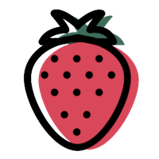

<div align="center">
  
</div>

# Berry House


[](https://berryhouse.ca)
[](https://www.netlify.com/)


[](LICENSE)

Berry House is a small, values‑driven studio site and writing hub built with Eleventy and Tailwind CSS. It emphasizes accessibility, performance, and IndieWeb principles—owning your platform and content.

This repository contains the production code for the Berry House agency website. It is not a generic theme or starter. If you’re looking for a reusable blog starter, please see the template this site is based on (created by the same author):

- 11ty Indie Web Blog Starter: https://github.com/brennanbrown/11ty-Indie-Web-Blog-Starter
- Live demo of the starter: https://indieweb-blog-starter.netlify.app/

- Live site: https://berryhouse.ca/
- Repository: https://github.com/brennanbrown/berryhouse

## At a Glance

- **Description**: Hi. We're here to help you create and share meaningful work and art with the world.
- **Author**: Brennan Kenneth Brown
- **Location**: Calgary, Alberta, Canada
- **Contact**: hi@berryhouse.ca
- **Focus**: Accessibility, performance, IndieWeb principles, digital autonomy

## 💝 Support This Work

Berry House operates on a dual mission: providing professional services at market rates while offering **pro bono and pay-what-you-can support** to marginalized communities, vulnerable individuals, and low-income nonprofits.

Your support helps sustain this model and enables me to:
- Continue building **free, open-source themes and tools** for the IndieWeb community
- Offer **accessible web development services** to those who couldn't otherwise afford them
- Maintain and improve **community resources** like Write Club and educational content
- Dedicate time to **pro bono work** for social justice organizations and marginalized creators

**Ways to support:**

<div align="center">

[](https://ko-fi.com/brennan)
[](https://www.patreon.com/cw/brennankbrown)
[](https://github.com/sponsors/brennanbrown)

</div>

Every contribution—no matter the size—makes a meaningful difference. Thank you for believing in a more accessible, equitable web. 🍓

---

## Key Sections

- **Portfolio** — Client work and case studies: https://berryhouse.ca/portfolio/
- **Résumé** — Experience and skills: https://berryhouse.ca/resume/
- **Links** — Curated resources and bookmarks: https://berryhouse.ca/links/
- **Bookshelf** — Reading list and notes: https://berryhouse.ca/bookshelf/
- **Services** — Offerings and engagement model: https://berryhouse.ca/services/
- **Education Hub** — Guides and learning materials: https://berryhouse.ca/education/
- **Community Showcase** — Sites and projects from the community: https://berryhouse.ca/showcase/

## Tech Stack
- Eleventy (11ty) for site generation
- Nunjucks templating
- Tailwind CSS for styling
- Client‑side search with FlexSearch
- Optional analytics (Plausible)

> New to this? Read the non-technical guide: [GUIDE.md](./GUIDE.md)

## Site Features

- **Simple setup** - Edit one config file and you're ready to publish
- **IndieWeb ready** - Microformats, webmentions, and RSS built-in
- **Modern design** - Clean, accessible, mobile-first interface
- **Privacy focused** - No tracking by default, optional ethical analytics
- **Full-featured** - Search, tags, dark mode, and more

## ⚡ Quick Start

1. **Clone and install**:
   ```bash
   git clone https://github.com/brennanbrown/berryhouse.git
   cd berryhouse
   npm install
   ```

2. **Configure the site** (most important step!):
   Edit `src/_data/site.json` with your information:
   ```json
   {
     "name": "Your Blog Name",
     "author": "Your Name", 
     "email": "your@email.com",
     "url": "https://yourdomain.com",
     "bio": {
       "short": "Your tagline",
       "long": "Your longer bio..."
     },
     "social": {
       "github": "yourusername",
       "mastodon": "@you@mastodon.social"
     }
   }
   ```

3. **Start the dev server**:
  ```bash
  npm run dev
  ```
  Visit `http://localhost:8080` and start creating!

4. **Build for production**:
  ```bash
  npm run build
  ```

## 🧑‍💻 Development

- Run dev server (with Tailwind watcher): `npm run dev`
- Build the site: `npm run build`
- Take portfolio screenshots (local): `npm run shots:portfolio`
- Take portfolio screenshots (live links): `npm run shots:portfolio:live`

### 🎨 Logo & Icons

The site uses a custom logo that's automatically converted to all necessary formats:

```bash
npm run build:icons  # Generate all icon sizes from new-logo.png
```

This script generates:
- **Favicons**: `favicon.ico`, `favicon-16x16.png`, `favicon-32x32.png`, `favicon-48x48.png`
- **Apple Touch Icons**: `apple-touch-icon.png`, `apple-touch-icon-precomposed.png`
- **PWA Icons**: `icon-192x192.png`, `icon-512x512.png`
- **Social/OG Image**: `og-default.png` (1200x630)
- **Brand Assets**: `logo-footer.png` (64px), `logo-readme.png` (200px)

To update the logo, replace `new-logo.png` in the project root and run `npm run build:icons`.

## ✅ Testing

This project includes a simple build validation:

- Run tests: `npm test` or `npm run test:build`
- End-to-end accessibility checks: `npm run test:e2e`

Search index is generated at build time (`/search.json`) via a custom Eleventy collection.

## 🛠️ Configuration

This project uses a single configuration file, `src/_data/site.json`, for most customization:

Quick reference (matches usage in `src/_includes/layouts/post.njk`, `src/contact.njk`, and `src/donate.njk`):

- **Newsletter** (renders on posts when enabled):
  ```json
  {
    "newsletter": {
      "enabled": true,
      "provider": "buttondown",
      "action": "https://buttondown.email/api/emails/embed-subscribe/yourusername",
      "title": "Join the Newsletter",
      "description": "Get thoughtful updates delivered to your inbox."
    }
  }
  ```
  Use any provider by swapping the `action` with a POST endpoint.

- **Contact form** (configure a backend):
  In `src/contact.njk`, wire up Netlify Forms or a service like Formspree/Basin by adding provider attributes, e.g.:
  ```html
  <form name="contact" method="POST" data-netlify="true">
    <input type="hidden" name="form-name" value="contact">
    <!-- fields -->
  </form>
  ```

- **Donations/Sponsorship** (renders on `/donate/`):
  ```json
  {
    "donate": {
      "enabled": true,
      "kofi": "yourusername",
      "buymeacoffee": "yourusername",
      "github": "yourusername",
      "message": "If you find value in my writing, consider supporting my work."
    }
  }
  ```

### Essential Settings
- **Site info**: Name, description, URL, author
- **Social links**: GitHub, Mastodon, Twitter (all optional)
- **Bio**: Short tagline and longer description
- **Contact**: Email and location

### Optional Features
- **Newsletter**: Buttondown, ConvertKit, or custom integration
- **Donations**: Ko-fi, Buy Me a Coffee, GitHub Sponsors
- **Analytics**: Plausible, Fathom, or Simple Analytics
- **Webmentions**: Automatic setup with webmention.io

### Quick Setup Examples

**Minimal setup** (just the essentials):
```json
{
  "name": "My Blog",
  "author": "Jane Doe",
  "email": "jane@example.com",
  "url": "https://janedoe.blog"
}
```

**Full setup** with all features:
```json
{
  "name": "Jane's Digital Garden",
  "author": "Jane Doe",
  "email": "jane@example.com", 
  "url": "https://janedoe.blog",
  "bio": {
    "short": "Writer & digital minimalist",
    "long": "I write about technology, minimalism, and intentional living."
  },
  "social": {
    "github": "janedoe",
    "mastodon": "@jane@mastodon.social"
  },
  "newsletter": {
    "enabled": true,
    "provider": "buttondown",
    "action": "https://buttondown.email/api/emails/embed-subscribe/jane"
  },
  "analytics": {
    "enabled": true,
    "provider": "plausible"
  }
}
```

## 📁 Project Structure

```
src/
├── _data/
│   ├── site.json       # 🎯 Main config file (edit this!)
│   └── tagColors.json  # Tag color mappings
├── _includes/
│   ├── layouts/        # Page layouts
│   └── partials/       # Reusable components
├── assets/
│   ├── css/           # Tailwind CSS
│   └── js/            # Interactive features
├── blog/              # 📝 Your blog posts go here
├── about.njk          # About page
├── contact.njk        # Contact page  
├── uses.njk           # Tools & setup page
├── now.njk            # What you're up to now
├── blogroll.njk       # Recommended blogs
├── archive.njk        # Post archive
└── style.njk          # Living style guide
```

## 🖼️ Configurable Placeholder Assets

This project includes a tiny build helper that fetches placeholder images so your site looks complete out‑of‑the‑box without committing binaries. Files are saved to `src/assets/` and passed through to `/assets/` at build time.

What gets fetched by default:

- **profile.jpg** — used on `about` page
- **og-default.png** — fallback Open Graph image
- **retro-stars.png** — background tile used in one demo post

How to customize:

- **Drop in your own files**: place files with the same names in `src/assets/` and the fetcher will skip downloading.
- **Environment variables**: set any of these to your own URLs
  - `PROFILE_IMAGE_URL`
  - `OG_DEFAULT_URL`
  - `RETRO_STARS_URL`
  - Example: `PROFILE_IMAGE_URL=https://example.com/me.jpg npm run build`
- **site.json config**: add an optional `assets` section to `src/_data/site.json`:
  ```json
  {
    "assets": {
      "profileUrl": "https://example.com/me.jpg",
      "ogDefaultUrl": "https://example.com/og.png",
      "retroStarsUrl": "https://example.com/retro-stars.png"
    }
  }
  ```
- **Skip entirely**: set `SKIP_FETCH_ASSETS=1` (or `true`) to bypass downloading (useful for offline/CI).

The fetcher runs as part of the build (`npm run build`), before CSS and Eleventy.

## 🚀 Deployment

### Netlify (recommended)
1. Connect the repository `brennanbrown/berryhouse` in Netlify
2. Build command: `npm run build`
3. Publish directory: `_site`
4. Set the primary domain to `berryhouse.ca`

### Other static hosts
1. Run `npm run build`
2. Upload the contents of the `_site/` directory to your host (e.g., Cloudflare Pages, GitHub Pages with a workflow, Vercel static)

## 🌐 IndieWeb Setup

This project includes IndieWeb features out of the box:

### Webmentions
1. Sign up at [webmention.io](https://webmention.io)
2. Add your domain to `site.json`:
   ```json
   "webmentions": {
     "enabled": true,
     "domain": "yourdomain.com"
   }
   ```

### Microformats
- h-card for your identity
- h-entry for blog posts  
- h-feed for your blog listing
- All automatically included!

## 🎨 Customization

### Colors & Styling
- Edit `tailwind.config.cjs` for theme colors
- Modify `src/assets/css/build.css` for custom styles
- Update `src/_data/tagColors.json` for tag colors

### Adding Pages
1. Create a new `.njk` file in `src/`
2. Add front matter with layout and permalink
3. Add navigation link in `src/_includes/layouts/base.njk`

### Newsletter Integration
Supports multiple providers:
- **Buttondown**: Set `newsletter.provider` to `"buttondown"`
- **ConvertKit**: Set to `"convertkit"` 
- **Custom**: Use any form action URL

## 🗺️ Roadmap

We track work for this agency site in issues/PRs. Larger feature requests and reusable improvements should be proposed in the underlying starter project when appropriate.

## 🤝 Contributing

Contributions are welcome. Please note this is the Berry House agency website—not a generic template. Use this repo for fixes to copy, accessibility, performance, or build issues specific to berryhouse.ca.

- For site issues (typos, broken links, accessibility, performance): open an issue here.
- For reusable features or starter-specific improvements: contribute to the 11ty Indie Web Blog Starter instead: https://github.com/brennanbrown/11ty-Indie-Web-Blog-Starter

Workflow:
1. Fork the repository
2. Create a feature branch
3. Make your changes (include clear commit messages)
4. Open a PR with a concise description, screenshots if applicable, and notes on testing

## 📄 License

MIT License — see [LICENSE](./LICENSE).

Note: this repository is the Berry House agency website (production code). If you need a reusable starter, use the 11ty Indie Web Blog Starter linked above.

## 🙏 Acknowledgments

Built with:
- [Eleventy](https://11ty.dev) - Static site generator
- [Tailwind CSS](https://tailwindcss.com) - Utility-first CSS
- [FlexSearch](https://github.com/nextapps-de/flexsearch) - Client-side search
- IndieWeb principles and community wisdom

---

**Ready to break free from social media?** Clone this template and start building your corner of the independent web! 🌱
